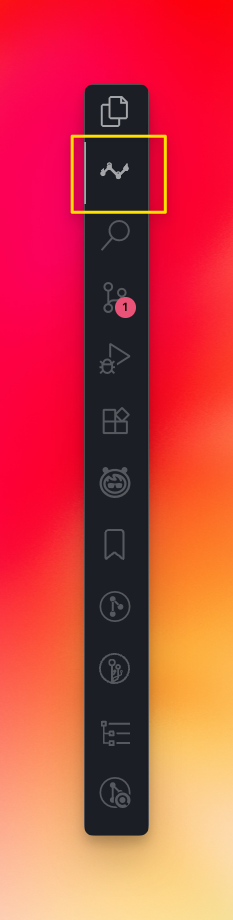
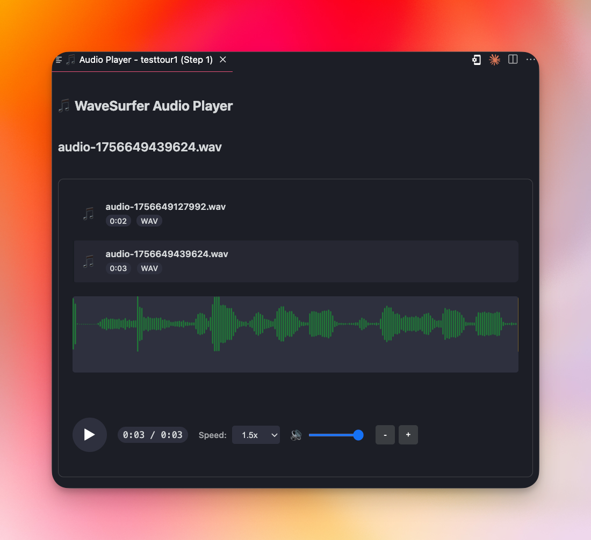
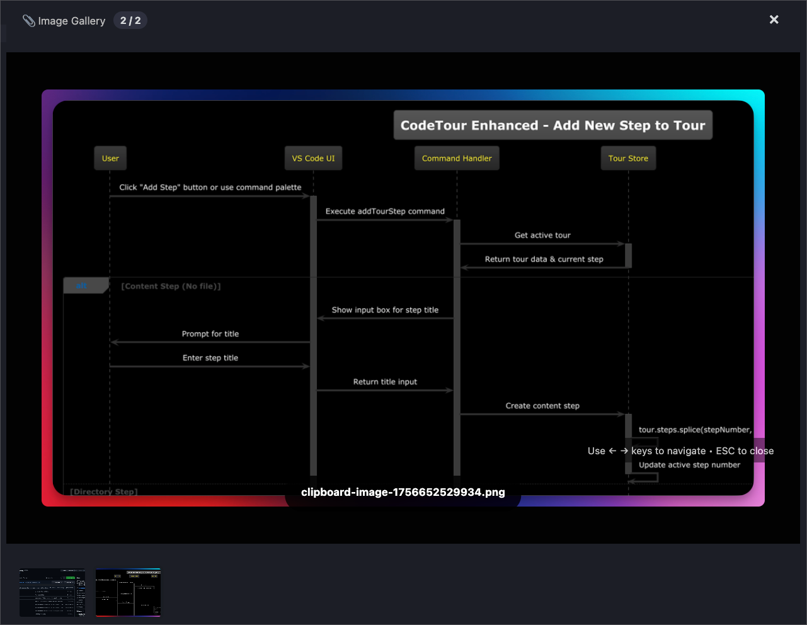
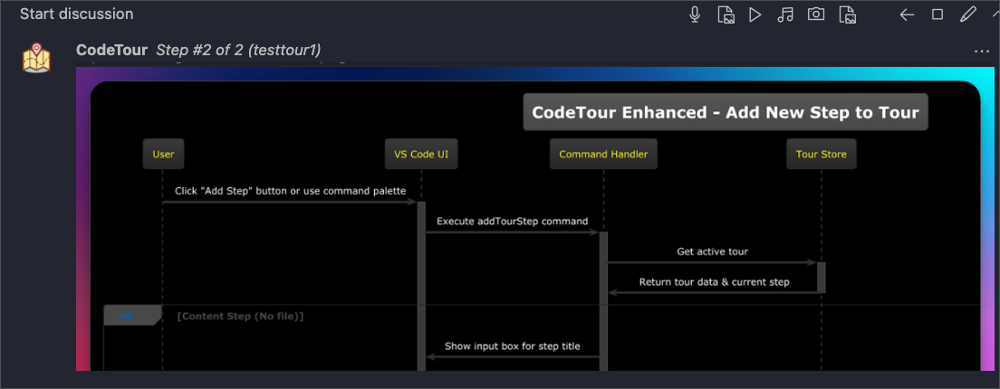
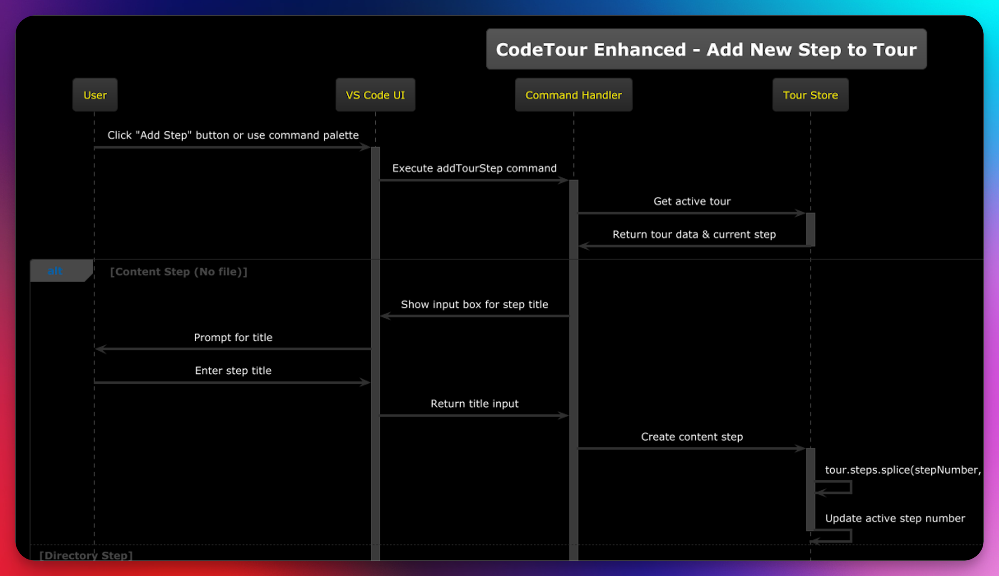

# CodeTour Enhanced 🚀🗺️

**An enhanced VS Code extension with advanced audio recording, improved image galleries, PlantUML diagrams, and activity bar integration for guided codebase tours.**

[](https://github.com/mahmutsalman/codetour-enhanced)
[](LICENSE.txt)

## 🎯 About

CodeTour Enhanced is a significantly improved version of Microsoft's popular CodeTour extension, featuring powerful new capabilities for creating immersive, multimedia code walkthroughs directly within Visual Studio Code.

## 🖼️ Visual Showcase

See CodeTour Enhanced in action with rich multimedia features:

### 📊 Dedicated Activity Bar Integration


*CodeTour Enhanced features a dedicated icon in VS Code's activity bar (highlighted in yellow) for easy access to tour management*

### 🎵 Professional Audio with WaveSurfer.js


*Advanced audio player with real-time waveform visualization, playback controls, and speed adjustment*

### 🖼️ Rich Image Galleries


*Enhanced image gallery system with navigation controls and seamless integration within tour steps*

### 🖼️ Images Within Tour Comments


*Images and diagrams displayed directly within CodeTour comments for enhanced documentation*



*Images can be viewed in full-screen mode for detailed inspection*

## 🔥 Enhanced Features

**🎵 Advanced Audio Recording System**
- Professional audio recording with WaveSurfer.js integration
- Real-time waveform visualization and playback controls
- Speed adjustment (0.5x to 2x) for different learning paces
- Multiple audio tracks per tour step
- High-quality WAV format support
- Audio timeline navigation

**🖼️ Improved Image Gallery**
- Full-screen image gallery with navigation (2/2 indicator)
- Keyboard navigation support (← → keys, ESC to close)
- Support for clipboard images and file uploads
- Professional image viewer with zoom and pan
- Image management and organization tools

**🖼️ Enhanced Image Display**
- Images displayed directly within tour comments
- Full-screen image viewer for detailed inspection
- Support for various image formats (PNG, JPG, diagrams)
- Seamless integration with tour step documentation
- Professional image rendering within VS Code interface

**📊 Activity Bar Integration**  
- Dedicated CodeTour sidebar in VS Code's activity bar
- Streamlined tour management and navigation
- Quick access to recording and editing tools
- Enhanced tour organization and filtering

**⚡ Performance & Quality Improvements**
- Optimized VSIX bundling and loading
- Enhanced VS Code settings integration
- Improved stability and error handling
- Modern web technologies integration

## 🙏 Attribution

This project is based on Microsoft's excellent **[CodeTour extension](https://github.com/microsoft/codetour)**, originally created by the Visual Studio Live Share team. All core tour functionality, navigation, and basic features are derived from their outstanding work.

**Original Repository**: https://github.com/microsoft/codetour  
**Original Authors**: Microsoft Corporation  
**License**: MIT (maintained)

## 🚀 Getting Started

### Installation

1. Download the latest `.vsix` file from the [releases page](https://github.com/mahmutsalman/codetour-enhanced/releases)
2. Install via VS Code:
   ```
   code --install-extension codetour-enhanced-0.60.0.vsix
   ```
3. Or install through VS Code's Extensions panel: "Extensions: Install from VSIX..."

### Quick Start

1. **Record a Tour**: Click the `+` button in the CodeTour Enhanced activity bar panel
2. **Add Audio**: Use the microphone button to record professional audio narration
3. **Include Images**: Add images from clipboard or files to enhance explanations
4. **Navigate**: Use the enhanced sidebar to manage and navigate your tours

## 📚 Enhanced Documentation

### Audio Recording Features

#### Professional Audio Capture
- Crystal-clear WAV format recording with high fidelity
- WaveSurfer.js powered audio player with real-time waveform visualization
- Playback speed control (0.5x, 1x, 1.5x, 2x) for optimal learning pace
- Professional audio controls with play/pause, timeline scrubbing, and volume

#### Advanced Audio Interface
The audio player features:
- **Visual Waveform**: Real-time green waveform display for audio visualization
- **Playback Controls**: Professional play/pause, timeline navigation
- **Speed Control**: Adjustable playback speed for different learning preferences  
- **Audio Library**: Manage multiple audio files per tour step
- **High Quality**: WAV format ensures crystal-clear audio quality

#### Audio Management
- Multiple audio tracks per tour step (as shown: audio-1756649127992.wav, audio-1756649439624.wav)
- Organized audio library with file duration and format display
- Seamless integration within VS Code's interface
- Professional audio player modal with full controls

### Image Gallery Enhancements

#### Full-Screen Gallery Experience
- **Professional Image Viewer**: Full-screen modal with navigation (2/2 indicator)
- **Keyboard Navigation**: Use ← → arrow keys to navigate, ESC to close
- **Image Support**: Display various image types including diagrams and screenshots
- **High-Resolution Display**: Crystal-clear rendering of complex diagrams and images

#### Advanced Image Handling
- **Multiple Format Support**: PNG, JPG, GIF, WebP, and diagram images
- **Clipboard Integration**: Quick image additions from clipboard (clipboard-image-1756652529934.png)  
- **Professional Navigation**: Intuitive gallery controls with image counter and close button
- **Comment Integration**: Images displayed directly within tour step comments

#### Enhanced Image Display
- **In-Comment Viewing**: Images rendered directly within CodeTour comments
- **Full-Screen Mode**: Click images for detailed full-screen inspection
- **Professional Presentation**: Clean, integrated display within VS Code interface
- **Documentation Enhancement**: Visual aids seamlessly integrated with text explanations

### Activity Bar Integration

#### Dedicated VS Code Integration
- **Activity Bar Icon**: Dedicated CodeTour Enhanced icon in VS Code's activity bar (highlighted position)
- **Easy Access**: Single-click access to all tour management features
- **Native Integration**: Seamlessly integrated with VS Code's native UI patterns
- **Professional Placement**: Positioned among other essential VS Code tools

#### Enhanced Tour Management
- **Centralized Control**: All tour creation, editing, and playback from one location
- **Quick Actions**: Fast access to recording, editing, and navigation tools
- **Tour Organization**: Comprehensive tour library management
- **Visual Feedback**: Clear visual indicators for active tours and recording state

## 🛠️ Development

### Building from Source

```bash
# Clone the repository
git clone https://github.com/mahmutsalman/codetour-enhanced.git
cd codetour-enhanced

# Install dependencies
npm install

# Build the extension
npm run build

# Package for distribution
npm run package
```

### Enhanced Build Process
- Webpack optimization for audio libraries
- Efficient VSIX packaging
- Resource bundling improvements
- Development mode enhancements

## 🔧 Configuration

### Enhanced Settings

```json
{
  "codetour.promptForWorkspaceTours": true,
  "codetour.recordMode": "lineNumber",
  "codetour.showMarkers": true,
  "codetour.customTourDirectory": null,
  "codetour.audioQuality": "high",
  "codetour.imageMaxSize": "2MB",
  "codetour.activityBarEnabled": true,
  "codetour.waveSurferEnabled": true,
  "codetour.galleryNavigation": "keyboard",
  "codetour.audioSpeedControl": true
}
```

#### New Configuration Options

- **`waveSurferEnabled`**: Enable/disable WaveSurfer.js audio visualization (default: true)
- **`galleryNavigation`**: Control image gallery navigation method ("keyboard", "buttons", "both")
- **`audioSpeedControl`**: Enable playback speed adjustment controls (default: true)

## 🤝 Contributing

We welcome contributions! This enhanced version maintains full compatibility with the original CodeTour format while adding powerful new features.

### Areas for Contribution
- Audio codec improvements
- Additional image formats
- Enhanced UI/UX patterns  
- Performance optimizations
- Accessibility improvements

## 📄 License

MIT License - Same as the original CodeTour extension

## 🔗 Links

- **Enhanced Version**: https://github.com/mahmutsalman/codetour-enhanced
- **Original CodeTour**: https://github.com/microsoft/codetour
- **Issue Tracker**: https://github.com/mahmutsalman/codetour-enhanced/issues
- **Changelog**: [CHANGELOG.md](CHANGELOG.md)

## 🚧 Roadmap

- [ ] Video recording capabilities
- [ ] Advanced tour analytics
- [ ] Team collaboration features
- [ ] Cloud synchronization
- [ ] Mobile companion app
- [ ] AI-powered tour suggestions

---

**Made with ❤️ by [Mahmut Salman](https://github.com/mahmutsalman)**  
*Building upon the excellent foundation provided by Microsoft's CodeTour team*