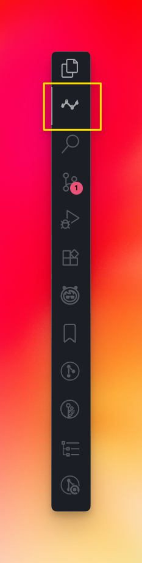
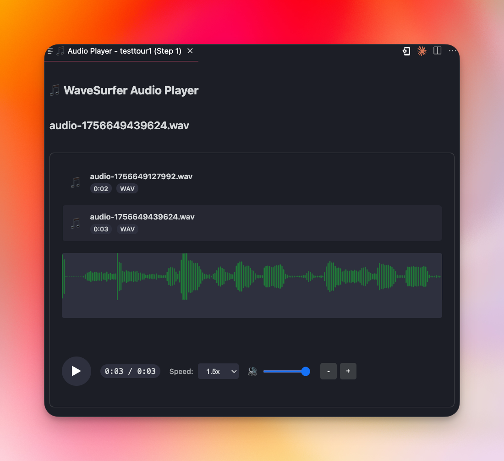
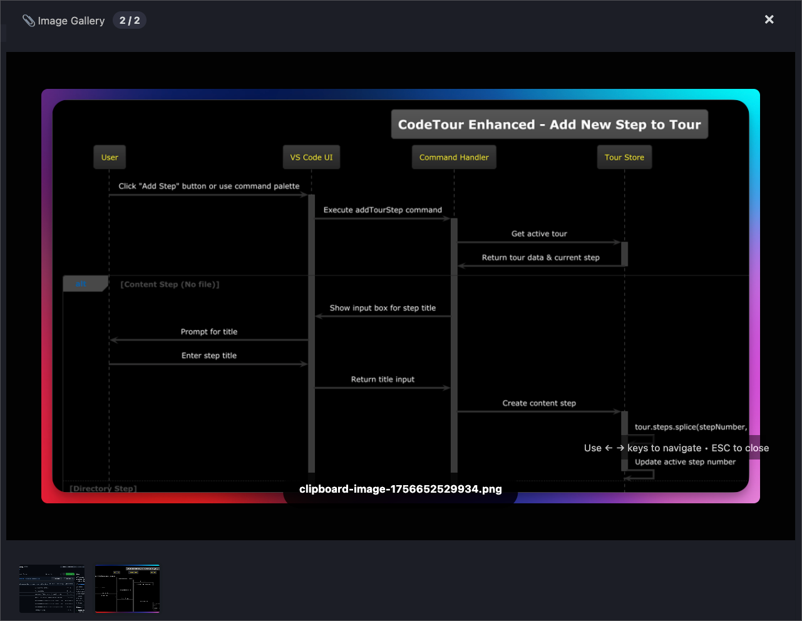
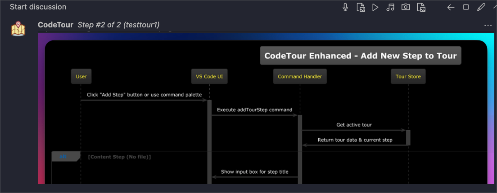
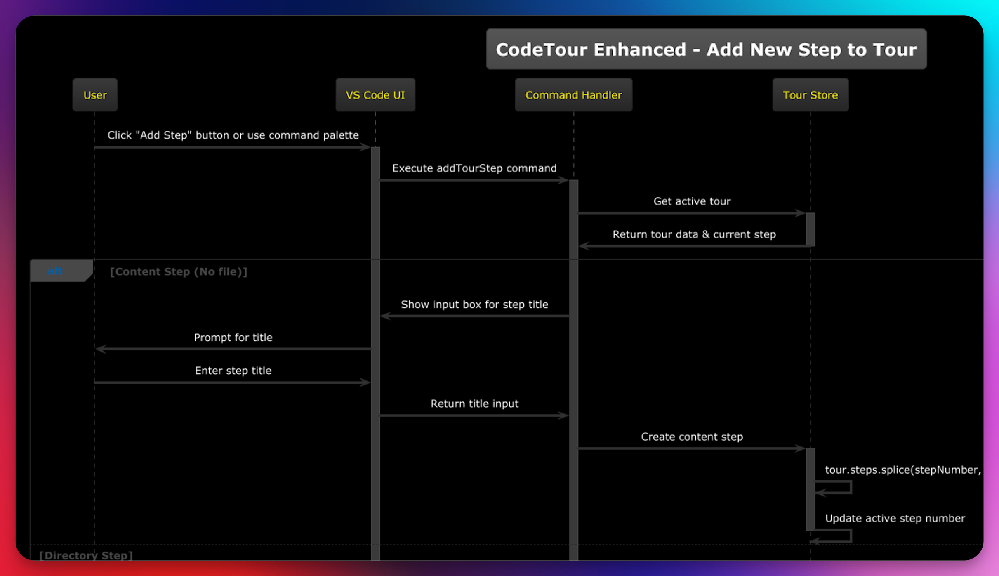

# CodeTour Enhanced 🚀🗺️

**An enhanced VS Code extension with advanced audio recording, rich notes editor, zoomable image galleries, topic grouping, tour sorting & filtering, PlantUML diagrams, and activity bar integration for guided codebase tours.**

[](https://github.com/mahmutsalman/codetour-enhanced)
[](LICENSE.txt)

## 🎯 About

CodeTour Enhanced is a significantly improved version of Microsoft's popular CodeTour extension, featuring powerful new capabilities for creating immersive, multimedia code walkthroughs directly within Visual Studio Code.

## 🖼️ Visual Showcase

See CodeTour Enhanced in action with rich multimedia features:

### 📊 Dedicated Activity Bar Integration


*CodeTour Enhanced features a dedicated icon in VS Code's activity bar (highlighted in yellow) for easy access to tour management*

### 🎵 Professional Audio with WaveSurfer.js


*Advanced audio player with real-time waveform visualization, playback controls, and speed adjustment*

### 🖼️ Rich Image Galleries


*Enhanced image gallery system with navigation controls and seamless integration within tour steps*

### 🖼️ Images Within Tour Comments


*Images and diagrams displayed directly within CodeTour comments for enhanced documentation*



*Images can be viewed in full-screen mode for detailed inspection*

## 🔥 Enhanced Features

**🎵 Advanced Audio Recording System**
- Professional audio recording with WaveSurfer.js integration
- **Real voice amplitude waveform** — live visualization reflects actual microphone input
- **Pause/resume recording** mid-session without stopping
- **Timestamp markers** — bookmark moments during recording for easy navigation
- **Rich Quill.js captions** per audio clip — expand on click, auto-saved
- Speed adjustment (0.5x to 2x) for different learning paces
- Multiple audio tracks per tour step
- WebM/Opus support for mobile-imported recordings
- Compact audio player UI with unified bottom panel playback engine
- **Dedicated Step Audio sidebar panel** — list, play, and manage clips without opening a modal
- **Select Microphone** command with dynamic detection and session persistence

**📝 Rich Notes Editor (Quill.js)**  ⭐ *NEW in v0.62.0*
- **Per-step Notes tab** in the bottom panel with a full Quill.js rich text editor
- **Tour-level (parent) notes** — a shared note attached to the whole tour, togglable from the bottom panel
- Theme-aware inline code styling that matches your VS Code color theme
- "Add Text" empty-state button so the editor is always one click away
- Auto-save preserves content without losing cursor focus

**🗂️ Advanced Tour Management**
- **8 Sorting Modes**: Name (A-Z/Z-A), Creation Date, Last Modified, Step Count
- **Real-time Filtering**: Instant text search across tour names and descriptions
- **Topic/Category Grouping** ⭐ *NEW* — assign tours to topics and browse them as collapsible groups in the sidebar
- **Persistent Preferences**: Sort, filter, and grouping settings remembered across sessions
- **Refresh Tours** button in the sidebar toolbar — reload tours without restarting VS Code
- **Multi-root workspace support** — tours work correctly across multi-root VS Code workspaces
- Professional UI with integrated toolbar buttons and Command Palette access

**🖼️ Interactive Image Gallery**
- **Full Zoom Support**: Mouse wheel + Ctrl/Cmd, pinch-to-zoom, zoom buttons (50%–500%)
- **Click & Drag Panning**: Navigate around zoomed images with smooth interactions
- **Step Images sidebar panel** ⭐ *NEW* — thumbnail grid of all images for the current step in the sidebar
- **Right-click thumbnails to cycle border color** — visually tag or highlight images
- **Compact thumbnails** with intelligent HiDPI rendering and grid wrapping
- Full-screen navigation with keyboard shortcuts (+, -, 0, ←, →, ESC)
- Trackpad gesture support for pinch and pan

**🖥️ Sidebar Panels (Unified Step Media)**  ⭐ *NEW in v0.62.0*
- **Step Images panel**: browse and manage all images attached to the current step
- **Step Audio panel**: list, play, and delete audio clips directly from the sidebar
- Panels update automatically as you navigate tour steps
- Compact step comment widget — collapses by default to save vertical space

**🖱️ Drag-to-Terminal Shortcuts**  ⭐ *NEW in v0.62.0*
- Drag a **tour node** from the sidebar to the terminal → pastes the `.tour` file path
- Drag a **step node** from the sidebar to the terminal → pastes `tour-path:step-number`
- Speeds up scripting, sharing, and linking to specific tour locations

**📊 Activity Bar Integration**
- Dedicated CodeTour sidebar in VS Code's activity bar
- Streamlined tour management with sorting, filtering, and topic grouping
- Quick access to recording and editing tools
- Enhanced tour organization for large codebases

**⚡ Performance & Quality Improvements**
- Optimized VSIX bundling and loading
- Enhanced VS Code settings integration
- Improved stability and error handling
- Modern web technologies integration

## 🙏 Attribution

This project is based on Microsoft's excellent **[CodeTour extension](https://github.com/microsoft/codetour)**, originally created by the Visual Studio Live Share team. All core tour functionality, navigation, and basic features are derived from their outstanding work.

**Original Repository**: https://github.com/microsoft/codetour  
**Original Authors**: Microsoft Corporation  
**License**: MIT (maintained)

## 🚀 Getting Started

### Installation

1. Download the latest `.vsix` file from the [releases page](https://github.com/mahmutsalman/codetour-enhanced/releases)
2. Install via VS Code:
   ```
   code --install-extension codetour-enhanced-0.62.0.vsix
   ```
3. Or install through VS Code's Extensions panel: "Extensions: Install from VSIX..."

### Quick Start

1. **Record a Tour**: Click the `+` button in the CodeTour Enhanced activity bar panel
2. **Add Audio**: Use the microphone button to record professional audio narration
3. **Include Images**: Add images from clipboard or files to enhance explanations
4. **Add Notes**: Open the Notes tab in the bottom panel to write rich Quill.js annotations
5. **Organize**: Assign tours to topics and use sorting/filtering to manage large collections
6. **Navigate**: Use the enhanced sidebar to manage and navigate your tours

## 📚 Enhanced Documentation

### Audio Recording Features

#### Professional Audio Capture
- Crystal-clear WAV format recording with high fidelity
- WaveSurfer.js powered audio player with real voice amplitude waveform
- Pause/resume recording mid-session; add timestamp markers during recording
- Playback speed control (0.5x, 1x, 1.5x, 2x) for optimal learning pace
- Professional audio controls with play/pause, timeline scrubbing
- WebM/Opus files imported from mobile are played back correctly in VS Code

#### Audio Captions
- Each audio clip has a dedicated Quill.js notes field
- Click the caption area to expand the full editor; it collapses to a preview when not focused
- Captions auto-save so you never lose content mid-edit

#### Microphone Management
- **Select Microphone** command (`Ctrl+Shift+P → CodeTour: Select Microphone`)
- Dynamic detection of newly plugged-in external microphones
- Selected microphone is persisted for the session

#### Step Audio Sidebar Panel
- Lists all audio clips for the currently active tour step
- Play, pause, and delete clips without opening any modal
- Updates automatically when you navigate steps

### Notes Editor (Quill.js)

#### Per-Step Notes
- Open the **Notes** tab in the bottom panel while on any tour step
- Full Quill.js rich text editor: bold, italic, inline code, lists, links
- "Add Text" button shown when the note is empty for a quick start
- Auto-saves in the background without stealing keyboard focus

#### Tour-Level (Parent) Notes
- A shared note attached to the entire tour, not a single step
- Toggle visibility with the parent note button in the bottom panel toolbar
- Useful for recording overall context, goals, or prerequisites for a tour

### Image Gallery Enhancements

#### Step Images Sidebar Panel
- Thumbnail grid of every image attached to the current step, visible in the sidebar
- Right-click any thumbnail to cycle through border color tags for visual organization
- Crisp HiDPI rendering and responsive grid layout

#### Full-Screen Gallery Experience
- **Professional Image Viewer**: Full-screen modal with navigation counter
- **Keyboard Navigation**: ← → arrow keys to navigate, ESC to close, +/−/0 to zoom
- **Image Support**: PNG, JPG, GIF, WebP, and diagram images
- **High-Resolution Display**: Crystal-clear rendering of complex diagrams

### Sidebar Tree Structure

The left-hand panel (activity bar → CodeTour Enhanced) is a two-level tree:

```
▸ 📁 Onboarding  1 tour          ← Topic node (folder icon, shows tour count)
▸ 📁 backend     0 tours
  ▸ 📍 quill-rich-text-editing-sy...  ← Tour node (pin icon, shows step count)
  ▸ 📍 tour-test1  2 steps
  ▸ ✓  new-test-tour  0 steps    ← Completed tour (checkmark icon)
  ▸ ✓  first-tour    0 steps
```

**Node types:**
- **Topic node** (folder icon) — groups tours by category; shows total tour count; collapsible
- **Tour node** (pin/location icon) — an individual tour; shows its step count; expand to see steps
- **Completed tour** (green checkmark) — a tour you have finished; same expand behavior

**Toolbar (top of panel, left to right):**

| Icon | Action |
|------|--------|
| 👁 | Watch/preview current step |
| 📂 | Open tour file |
| ＋ | Create new tour |
| 1≡ | Sort tours (cycles through 8 sort modes) |
| ▽ | Filter tours (inline search box) |
| 📁 | Toggle topic grouping on/off |
| ↺ | Refresh tours from disk |
| ⊟ | Collapse all nodes |

### Tour Organization

#### Topic/Category Grouping
- Assign a topic/category to each tour when creating or editing it
- Tours with the same topic are grouped under a collapsible folder node in the sidebar (showing tour count)
- Ungrouped tours appear at the top level as before
- Toggle grouping on/off with the folder toolbar button

#### Sorting and Filtering
- Sort by Name, Creation Date, Last Modified, or Step Count (ascending or descending)
- Real-time filter box searches tour names and descriptions instantly
- All preferences persist across VS Code sessions

#### Drag-to-Terminal
- Drag a **tour** to the integrated terminal to paste its `.tour` file path
- Drag a **step** to the integrated terminal to paste `tour-path:step-number`

#### Refresh Tours
- Click the **Refresh** button (↺) in the tours panel toolbar
- Reloads all tours from disk — useful after external edits or `git pull`

### Activity Bar Integration

#### Dedicated VS Code Integration
- **Activity Bar Icon**: Dedicated CodeTour Enhanced icon in VS Code's activity bar
- **Easy Access**: Single-click access to all tour management features
- **Native Integration**: Seamlessly integrated with VS Code's native UI patterns

#### Enhanced Tour Management
- **Centralized Control**: All tour creation, editing, and playback from one location
- **Quick Actions**: Fast access to recording, editing, and navigation tools
- **Visual Feedback**: Clear visual indicators for active tours and recording state

## 🛠️ Development

### Building from Source

```bash
# Clone the repository
git clone https://github.com/mahmutsalman/codetour-enhanced.git
cd codetour-enhanced

# Install dependencies
npm install

# Build the extension
npm run build

# Package for distribution
npm run package
```

### Enhanced Build Process
- Webpack optimization for audio libraries
- Efficient VSIX packaging
- Resource bundling improvements
- Development mode enhancements

## 🔧 Configuration

### Enhanced Settings

```json
{
  "codetour.promptForWorkspaceTours": true,
  "codetour.recordMode": "lineNumber",
  "codetour.showMarkers": true,
  "codetour.customTourDirectory": null,
  "codetour.audioQuality": "high",
  "codetour.imageMaxSize": "2MB",
  "codetour.activityBarEnabled": true,
  "codetour.waveSurferEnabled": true,
  "codetour.galleryNavigation": "keyboard",
  "codetour.audioSpeedControl": true
}
```

#### Configuration Options

- **`waveSurferEnabled`**: Enable/disable WaveSurfer.js audio visualization (default: true)
- **`galleryNavigation`**: Control image gallery navigation method ("keyboard", "buttons", "both")
- **`audioSpeedControl`**: Enable playback speed adjustment controls (default: true)

## 🤝 Contributing

We welcome contributions! This enhanced version maintains full compatibility with the original CodeTour format while adding powerful new features.

### Areas for Contribution
- Audio codec improvements
- Additional image formats
- Enhanced UI/UX patterns  
- Performance optimizations
- Accessibility improvements

## 📄 License

MIT License - Same as the original CodeTour extension

## 🔗 Links

- **Enhanced Version**: https://github.com/mahmutsalman/codetour-enhanced
- **Original CodeTour**: https://github.com/microsoft/codetour
- **Issue Tracker**: https://github.com/mahmutsalman/codetour-enhanced/issues
- **Changelog**: [CHANGELOG.md](CHANGELOG.md)

## 🚧 Roadmap

- [ ] Video recording capabilities
- [ ] Advanced tour analytics
- [ ] Team collaboration features
- [ ] Cloud synchronization
- [ ] Mobile companion app
- [ ] AI-powered tour suggestions

---

**Made with ❤️ by [Mahmut Salman](https://github.com/mahmutsalman)**  
*Building upon the excellent foundation provided by Microsoft's CodeTour team*
